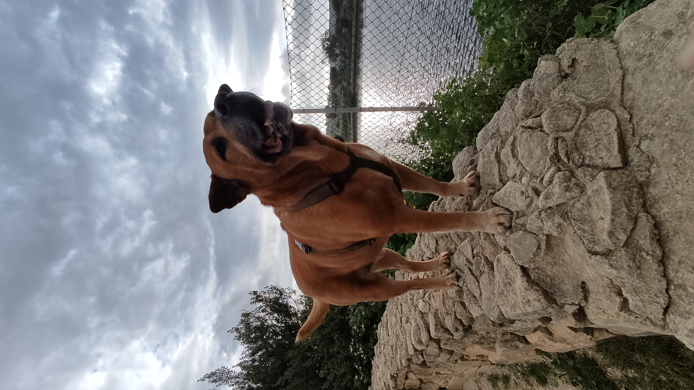

# 🐶 Why Dogs Make the Best Companions

Dogs have been by our side for thousands of years, and there’s a reason they’re known as _“man’s best friend.”_ They’re loyal, affectionate, and full of personality.

## ❤️ Unmatched Loyalty

Dogs form strong bonds with their humans and are known for their unwavering loyalty. Whether you're having a good day or a tough one, your dog is always happy to see you.

## 🧠 Smart and Trainable

Many breeds are highly intelligent and enjoy learning new things. From fetching the paper to performing tricks, dogs thrive when they’re mentally engaged.

## 🏃 Active Lifestyle Partners

Need motivation to go outside? Dogs are great companions for walks, hikes, and runs. They keep you active and make exercise feel like play.

## 🛋 Masters of Comfort

Dogs have an amazing sense for when you need comfort. A quiet nuzzle or a curled-up nap on your feet can make all the difference on a stressful day.

## 🧬 A Breed for Everyone

From tiny Chihuahuas to towering Great Danes, there's a breed for every kind of person and lifestyle:

- **Families:** Golden Retrievers, Labradors
- **Apartments:** French Bulldogs, Dachshunds
- **Active people:** Border Collies, Huskies
- **First-time owners:** Cavaliers, Poodles

## 📸 Dog Moments Make Life Better

Let’s be honest—your camera roll is 80% dog photos, right?

### My Dog Donny - Markdown example
#### With Html

#### With Markdown

---

> _“Dogs do speak, but only to those who know how to listen.”_ – Orhan Pamuk

Whether you're a lifelong dog lover or considering getting one, there's no denying the joy they bring into our lives.

🐾 Thanks for reading!
